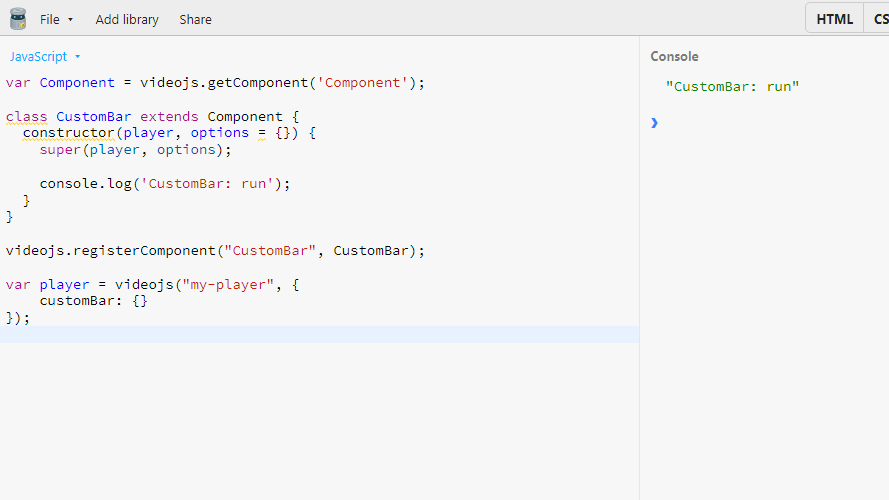

# Components

## Same name of component and option

Do not make the component name and player config option name the same, if there has an identical name, it will autorun when the component register.

The following component will autorun when register:

```js
class CustomBar extends Component { // highlight-line
  constructor(player, options = {}) {
    super(player, options);

    console.log('CustomBar: run');
  }
}

videojs.registerComponent("CustomBar", CustomBar); // highlight-line

var player = videojs("my-player", {
    customBar: {} // highlight-line
});
```

Demo:


