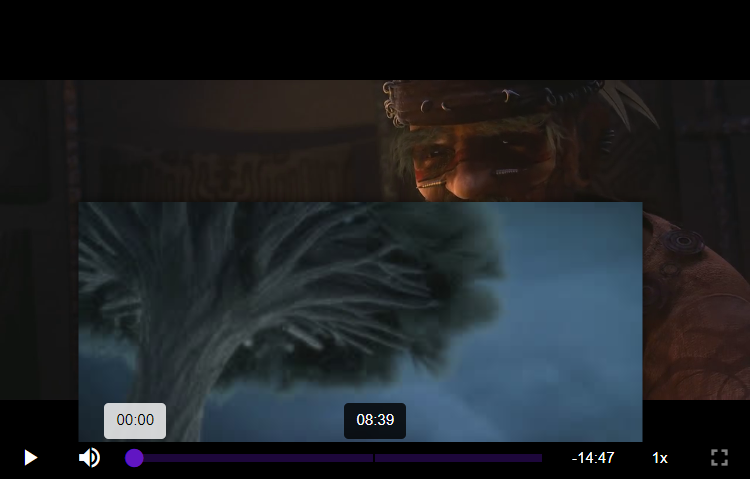

# Thumbnails

Repo: https://github.com/mayeaux/videojs-vtt-thumbnails \
<small>Forked from: https://github.com/chrisboustead/videojs-vtt-thumbnails</small>

Need to provide a VTT file. Based on [JWPlayer Preview Thumbnails Spec](https://support.jwplayer.com/articles/how-to-add-preview-thumbnails)

Note: this plugin currently only supports sprited thumbnails.

[](https://codesandbox.io/s/videojs-vtt-thumbnails-forked-vhphsi)

## Installation

```bash
npm install "https://github.com/mayeaux/videojs-vtt-thumbnails"
```

## Usage

```js
<script src="https://unpkg.com/video.js/dist/video.min.js"></script>
<script src="https://cdn.jsdelivr.net/gh/mayeaux/videojs-vtt-thumbnails@master/dist/videojs-vtt-thumbnails.min.js"></script>
<script>
var player = videojs('my-video', {
    sources: [{ "https://stream.mux.com/XAUyVQNQUpHCFH2qXYgi3JOcmGs4xovhczrhHQsgqJ4.m3u8" }]
});
player.vttThumbnails({
    src: "https://image.mux.com/XAUyVQNQUpHCFH2qXYgi3JOcmGs4xovhczrhHQsgqJ4/storyboard.vtt"
});
</script>
```

## Options

Example:

```js
var player = videojs('my-video', {
    sources: [{ "https://stream.mux.com/XAUyVQNQUpHCFH2qXYgi3JOcmGs4xovhczrhHQsgqJ4.m3u8" }]
});
player.vttThumbnails({
    src: "https://image.mux.com/XAUyVQNQUpHCFH2qXYgi3JOcmGs4xovhczrhHQsgqJ4/storyboard.vtt",
    showTimestamp: true
});
```

### Available Options

| Option          | Type    | Default | Description                                    |
| --------------- | ------- | ------- | ---------------------------------------------- |
| `showTimestamp` | Boolean | `false` | Disables the timestamp that is shown on hover. |
